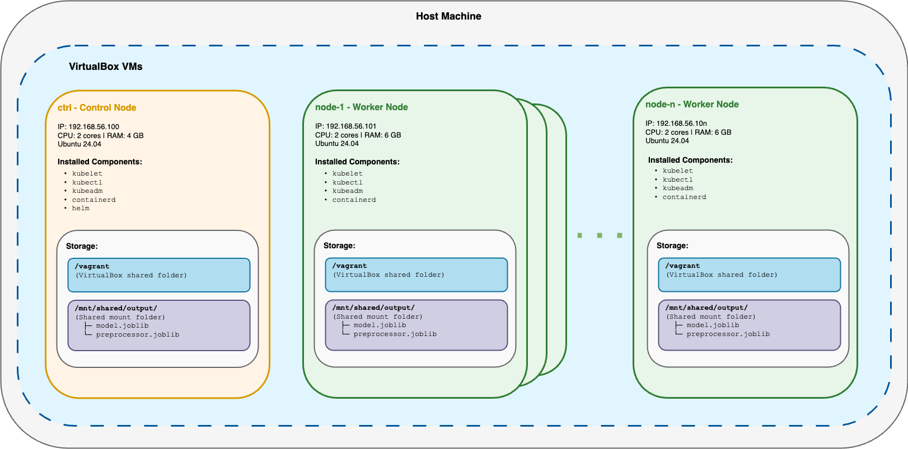
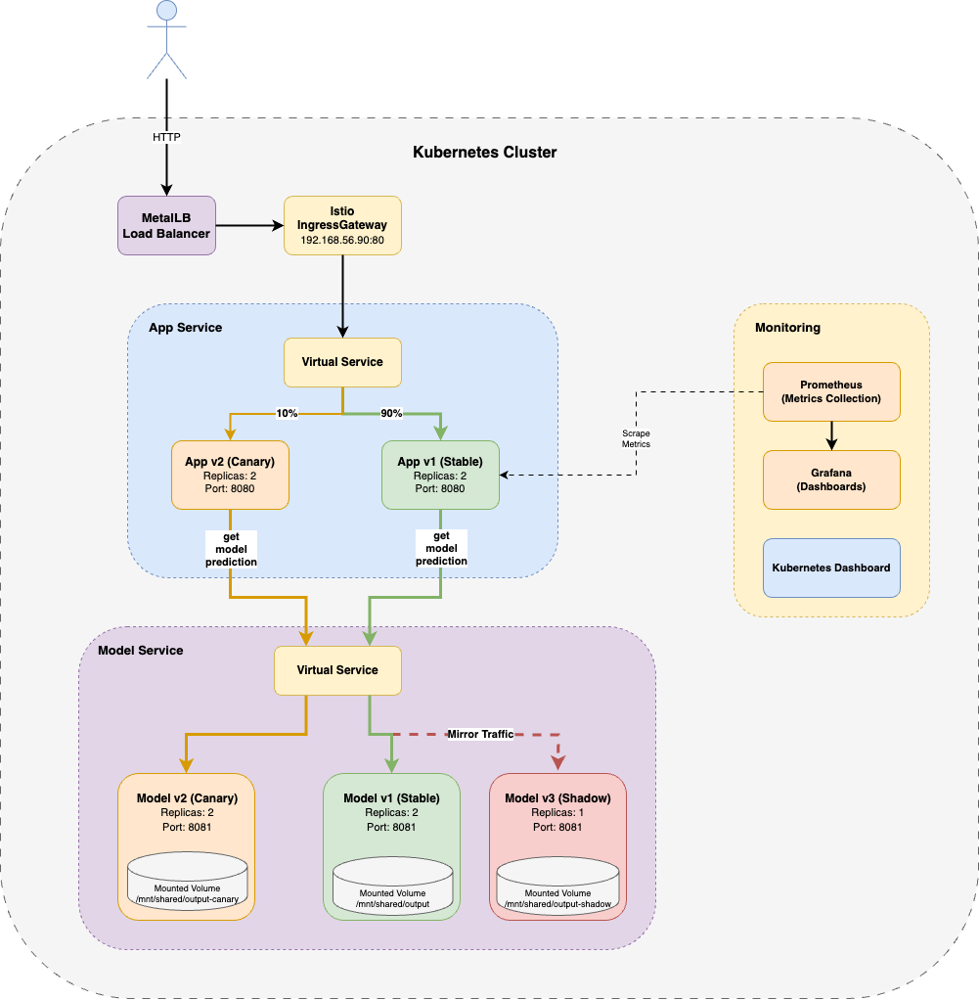
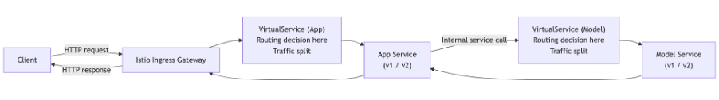

# Deployment Architecture

## Table of Contents

- [Deployment Architecture](#deployment-architecture)
  - [Table of Contents](#table-of-contents)
  - [Overview](#overview)
  - [Provisioning Infrastructure](#provisioning-infrastructure)
  - [Deployment Architecture](#deployment-architecture-1)
    - [App (Frontend)](#app-frontend)
    - [Model Service (Backend)](#model-service-backend)
    - [Istio](#istio)
    - [MetalLB](#metallb)
    - [Prometheus](#prometheus)
    - [Grafana](#grafana)
    - [Kubernetes Dashboard](#kubernetes-dashboard)
  - [Request Flow](#request-flow)
  - [External Access Summary](#external-access-summary)

---

## Overview

This document describes the deployment architecture for the SMS Spam Checker application, which uses a provisioned multi-node Kubernetes cluster running on VirtualBox VMs. The deployment uses two strategies:

1. Canary Release Strategy
2. Shadow Deployment Strategy

## Provisioning Infrastructure

The VirtualBox VMs on which the Kubernetes cluster is deployed, are provisioned using Vagrant and Ansible. This provisioning architecture is illustrated in the diagram below:

We have one control node and multiple worker nodes. The control node is responsible for managing the Kubernetes cluster, while the worker nodes run the workloads. Kubeadm is used to set up the Kubernetes cluster and join the nodes together.

## Deployment Architecture

The SMS Spam Checker application is deployed on the Kubernetes cluster with Istio service mesh. The diagram below illustrates the deployment architecture:

The SMS Spam Checker's exposed endpoint is `http://sms-checker-app/sms`, which can be access through the browser or using API clients. The API request format is as follows:

- URL: `http://sms-checker-app/sms`
- Method: POST
- Body: `{"message": "Your SMS text here"}`
- Response: `{"result": "spam" | "ham", "confidence": 0.0-1.0}`

As shown in the diagram, the deployment routing strategies are:

- **90/10 Split**: The App service has a stable deployment (v1) that handles 90% of the traffic, and a canary deployment (v2) that handles 10% of the traffic. This allows for a canary release strategy.
- **Shadow Deployment**: The Model Service has a shadow deployment (v3) that receives a copy of the traffic from the stable deployment (v1). This allows for testing new versions of the Model Service without affecting the live traffic.

Below are the details of each component in the deployment architecture.

### App (Frontend)

The App exposes the user interface for the SMS Spam Checker Application at `/sms`, where it forwards requests to the model service for predictions. And it exposes Prometheus metrics at the `/metrics` endpoint. It has two deployments: a stable deployment (v1) and a canary deployment (v2). The stable deployment handles 90% of the traffic, while the canary deployment receives 10% of the traffic for testing purposes.

**Technology**: Java Spring Boot 3.5.7 (Java 25)
**Repository**: https://github.com/doda25-team15/app

**Deployments:**

- **app-deployment-v1** (Stable)

  - Replicas: 2
  - Image: `ghcr.io/doda25-team15/app:v1.2.0`
  - Label: `version=v1`
  - Port: 8080

- **app-deployment-canary-v2** (Canary)
  - Replicas: 2
  - Image: `ghcr.io/doda25-team15/app:v1.2.1`
  - Label: `version=v2`
  - Port: 8080

### Model Service (Backend)

The Model Service exposes a REST API for predicting whether an SMS message is spam or not. It has three deployments: a stable deployment (v1), a canary deployment (v2), and a shadow deployment (v3). The stable deployment handles traffic from the stable deployment of the App service, the canary deployment receives the traffic from the canary deployment of the App service, and the shadow deployment receives a copy of the stable traffic for testing purposes.

**Technology:** Python 3.12.9 + Flask + scikit-learn
**Repository:** https://github.com/doda25-team15/model-service

**Deployments:**

- **model-service-deployment-v1** (Stable)

  - Replicas: 2
  - Image: `ghcr.io/doda25-team15/model-service:v1.0.2`
  - Label: `version=v1`
  - Port: 8081
  - Volume: `/mnt/shared/output` → `/app/output`

- **model-service-deployment-canary-v2** (Canary)

  - Replicas: 2
  - Image: `ghcr.io/doda25-team15/model-service:v1.0.2`
  - Label: `version=v2`
  - Port: 8081
  - Volume: `/mnt/shared/output-canary` → `/app/output`

- **model-shadow-v3** (Shadow)
  - Replicas: 1
  - Image: `ghcr.io/doda25-team15/model-service:v1.0.2`
  - Label: `version=v3`
  - Port: 8081
  - Volume: `/mnt/shared/output-shadow` → `/app/output`

### Istio

Istio is used as a service mesh to manage the traffic between the App and Model Service deployments. It has an Ingress Gateway that exposes the App Service for external traffic into the service mesh. There are two Virtual Services defined, one for traffic routing between the App and Model Service deployments, and another for the traffic routing to the App Service via the Ingress Gateway. The first one is responsible for mirroring the traffic from the stable Model Service deployment to the shadow deployment for testing purposes. The second Virtual Service is responsible for routing 90% of the traffic to the stable App deployment and 10% to the canary deployment, allowing for a canary release strategy.

**Ingress Gateway:**

- Port: 80

**Virtual Services for App Service:**

- If header contains `testing = true`, routes 100% to canary App deployment.
- Otherwise, routes 90% to stable App deployment and 10% to canary App deployment.

**Virtual Services for Model Service:**

- Routes 100% of traffic from canary App deployment to canary Model Service deployment.
- Routes 100% of traffic from stable App deployment to stable Model Service deployment.
- Mirrors 100% of traffic to the shadow Model Service deployment for testing purposes.

**Destination Rules:**

- Ensures users consistently route to the same App version during their session using cookie-based sticky sessions.

### MetalLB

MetalLB is used as a load balancer for the Kubernetes cluster, providing external access to the Istio Ingress Gateway. It assigns a static IP address to the Ingress Gateway service, allowing users to access the SMS Spam Checker application via a consistent endpoint.

### Prometheus

Prometheus is used for monitoring and alerting. It scrapes metrics from the App service at the `/metrics` endpoint. Prometheus runs on port 9090 and can be accessed by port forwarding the prometheus service from the host machine.

**Collected Metrics:**

- `sms_requests_total` (Counter): Total completed requests
- `sms_requests_inflight` (Gauge): Current in-flight requests
- `sms_request_latency_seconds` (Histogram): Request latency distribution

**Additional Monitoring:**

- Pod metrics (CPU, memory)
- Kubernetes cluster metrics
- Istio telemetry (traffic, latency, errors)

**Alerting:**
There is a simple alert configured that sends an alert to a slack channel if there are, on average, more than 15 SMS requests sent per minute for 2 minutes.

### Grafana

Grafana is used for visualizing the metrics collected by Prometheus. It provides dashboards for monitoring the performance and health of the SMS Spam Checker application and the Kubernetes cluster. Grafana runs on port 3000 and can be accessed by port forwarding the grafana service from the host machine.

**Custom Dashboards:**

- SMS Spam Checker Application Dashboard

### Kubernetes Dashboard

Kubernetes Dashboard is a web-based UI for managing and monitoring the Kubernetes cluster. It provides an overview of the cluster's resources, workloads, and namespaces. The dashboard can be accessed at `http://dashboard.192.168.56.90.nip.io`.

## Request Flow

The request path through the deployed system proceeds as follows, including all routing decisions and experimental behaviour.

1. ***Client → Istio Ingress Gateway***

    A user sends an HTTP POST request to the public application hostname exposed by the Istio Ingress Gateway.
    The request targets the /sms endpoint and contains the SMS text in the request body. Optional headers may be included to support experimentation.

2. ***Ingress Gateway → App VirtualService***

    The Istio Gateway forwards the request to the VirtualService associated with the application.
    At this point, Istio evaluates routing rules such as weights, header matches, and sticky-session configuration.

3. ***Canary Routing Decision (90/10 split)***

    The VirtualService applies a weighted routing rule that sends:
    - 90% of requests to the stable version of the app-service
    - 10% of requests to the canary version of the app-service

    Sticky sessions ensure that once a user is assigned to a version, subsequent requests are consistently routed to the same version.

4. ***App-Service → Model-Service (Version-Aligned Routing)***

    The selected app-service version forwards the request to the corresponding model-service version.
    DestinationRules ensure version consistency, preventing traffic from a new app-service reaching an old model-service (and vice versa).

5. ***Shadow Traffic Mirroring (Experimental Use Case)***

    In parallel to the primary request path, Istio mirrors the request to a shadow deployment of the model-service.
    The shadow service processes the request but does not influence the response returned to the user.

6. ***Model Inference and Metrics Collection***

    The primary model-service performs inference and returns the classification result to the app-service.
    Both the primary and shadow services emit Prometheus metrics describing request volume, latency, and classification outcomes.

7. ***Response → Client***

    The app-service returns the final classification result to the user via the Istio Ingress Gateway.

8. ***Monitoring and Visualisation***
    
    Prometheus scrapes metrics from all relevant services.
    Grafana dashboards visualise differences between stable, canary, and shadow traffic to support experimental evaluation.

MetalLB Load Balancer is used to assign a stable external IP to the Istio Ingress Gateway but does not participate in per-request routing and is therefore not included in the logical request flow.

## External Access Summary

The following table provides an overview of how external users and operators access the deployed system.

| Hostname | Path | Method | Headers | Purpose |
|---------|------|--------|---------|---------|
| `app.<domain>` | `/sms` | `POST` | *(optional)* `testing=true` | Submit an SMS for classification and participate in canary routing |
| `app.<domain>` | `/metrics` | `GET` | — | Expose application metrics for Prometheus scraping |
| `grafana.<domain>` | `/` | `GET` | — | Access Grafana dashboards for monitoring and experimentation |
| `dashboard.<domain>` | `/` | `GET` | — | Access the Kubernetes Dashboard for cluster inspection |

The `<domain>` placeholder represents the deployment-specific hostname configured via Helm values and mapped to the Istio Ingress Gateway IP (e.g., through local DNS or `/etc/hosts`).
